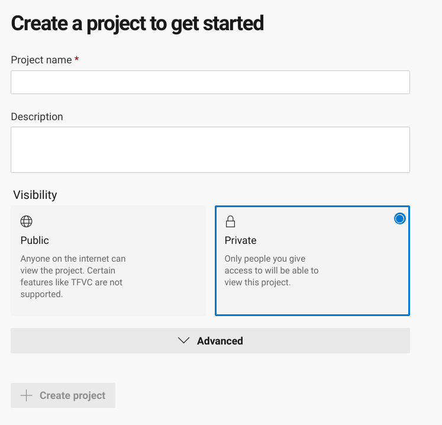
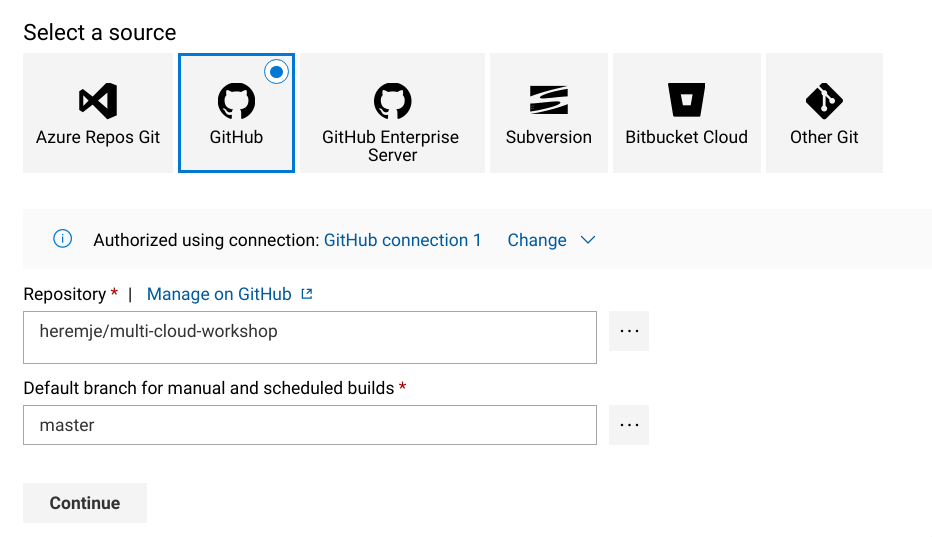
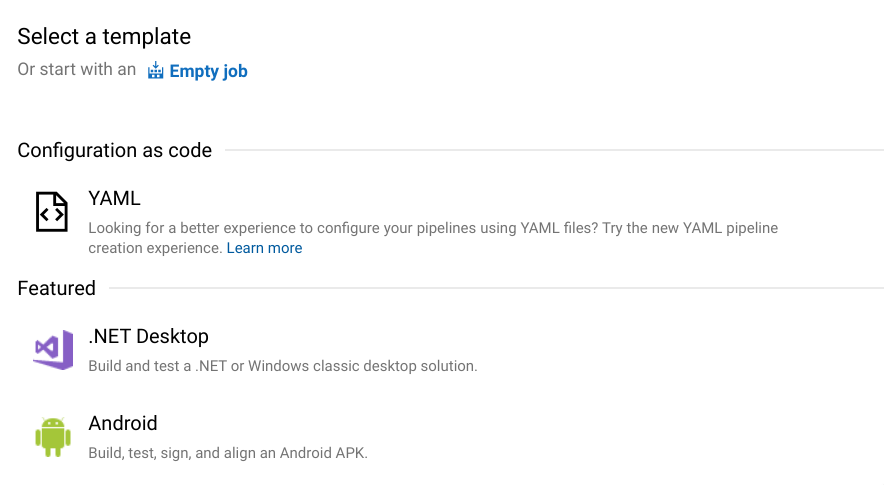
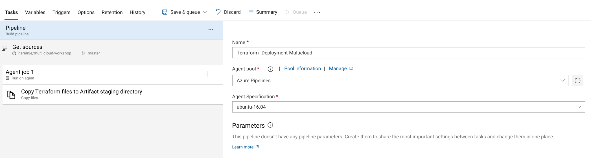
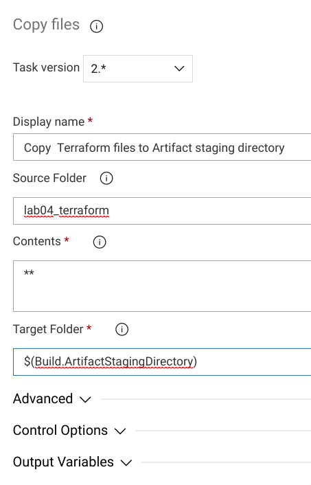
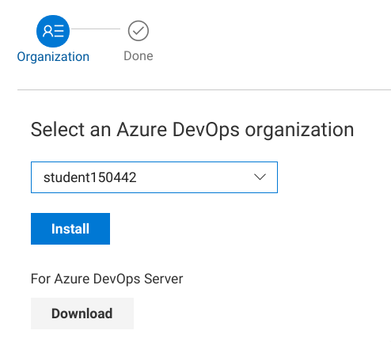
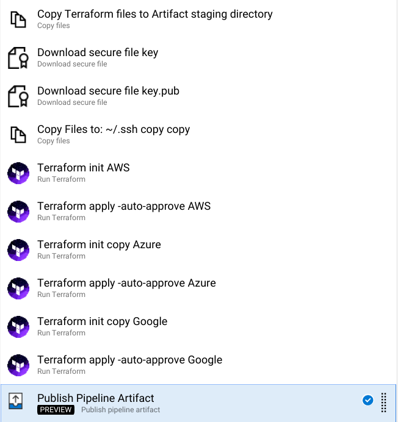

# Lab 05 -  Infrastructure pipeline #

## 1. Azure DevOps login ##

We will be using the Azure Devops platform to create our pipeline:

* URL: https://dev.azure.com/

Opening this URL should launch you straight into the devops platform. If it doesn't, then click the blue 'Start Free' button on the page and login using the same credentials as for the Azure portal.  
  

## 2. Fork the workshop repository ##

Browse to the workshop github page:

- URL: https://github.com/gluobe/multi-cloud-workshop

On the top right you should see a `Fork` button, click this buttion and fork the repository into your own GitHub account.

We're going to have to change our variables for terraform again. but we can't mix it up with the gluo repository we downloaded. So let's log back into our management server and run the following:  
`mkdir ~/projects`  
`cd ~/projects`  
`git clone https://github.com/YOURGITHUBUSERNAME/multi-cloud-workshop.git`  

Now in the`lab04_terraform` folder edit the variables.tf files in all 3 folders to match your studentID like we did in the previous lab.  

Once done editing we can push this back to GitHub.  
`cd ~/projects/multi-cloud-workshop`  
`git config --global user.email "YOURGITHUBEMAILADRESS@example.com"`  
`git add .`  
`git commit -m "Changed studentID variables"`  
`git push origin master`  

And enter your GitHub credentials

## 3. Create your pipeline ##

Click `Pipelines` on the left sidebar and select `New Pipeline`.  

iIt will ask you: `Where is your code?`. At the bottom, click `Use the classic editor to create a pipeline without YAML.`

Choose GitHub, click `Authorize using OAuth`, sign-in to your account if needed and authorize AzurePipelines.

You will then get the option to select a repository and default branch.  

Select your `multi-cloud-workshop` repository. The branch should be set to `master` already, if not, enter `master`.

Choose `Or start with an Empty job` at the top of the panel

You have now created an empty pipeline. Let's add some tasks

## 4. Edit your build pipeline ##

You should now be in the editing page for the build pipeline. If somehow you aren't, on the left panel go to `Pipelines` -> `Builds` then click the blue `Edit` button at the top.  

Click on the `Pipeline` bar under `Tasks` and change the name to something more useful like `Terraform-deployment-multicloud` and make sure the `Agent Specification` is set to `vs2017-win2016`. DO NOT change it to ubuntu as seen in the screenshot. :)

Click on the `+` sign on the `Agent Job 1` bar to add a new task.

A new panel with open up with a list of premade tasks. Search for `Copy Files` and add it. You may find multiple similar tasks but we want the one that is called `Copy Files` exactly.  

We will use this task to copy our terraform files to a staging directoty where we will create an artifact. This artifact is basically a package containing a compiled application or configuration files to pass along in our pipeline.

Click on the task and configure it as such:  
Display Name: `Copy Terraform files to Artifact staging directory`  
Source folder: `lab04_terraform`  
Contents: `**`  
Target Folder: `$(Build.ArtifactStagingDirectory)`  

To authorize with our different providers we need to add some environment variables to our build machine. Click on the variable tab.  

We need to add the following variables, the values will be provided in slack:
`GOOGLE_CREDENTIALS`  
`AWS_ACCESS_KEY_ID`  
`AWS_SECRET_ACCESS_KEY`  
`AWS_DEFAULT_REGION`  
`ARM_CLIENT_ID`  
`ARM_SUBSCRIPTION_ID`  
`ARM_TENANT_ID`  
`ARM_CLIENT_SECRET`  

We also need to add our SSH keys as secure files. These will also be provided in slack.  
To add the files go to `Library` -> `Secure files` and click on the `+` sign. There should be 2 key files available on slack, make sure you add both here.  

Go back to the edit page for our pipeline. Search for the `Download secure file` task and add 2 of them.  
In the task configuration select one of the keys for each task. You can edit the display name to represent which task downloads which file.

Now we need to copy the keys to another directory so terraform can find them. Search for the `Copy files` task and configure as described:
Display Name: `Copying SSH keys to Artifact staging folder`  
Source folder: `$(Agent.TempDirectory)`  
Content: `workshop*`  
Target folder: `C:\Users\VssAdministrator\.ssh`  

Now we can add the terraform tasks. Click on the `+` sign again and search terraform. These tasks are not installed by default so we will have to add it.
There are also multiple versions of this task. Search for the one made by `Peter Groenewegen` and click `Get it Free`.

You will be linked to an external page. Click the green `Get it Free` button and you will get to the install page. Your organization should already be filled in so just click `Install`.

Now go back to the edit page and add another task. Search for terraform again and you should see a `Run terraform` task available to add. You might need to refresh the page if you don't.  

Add  terraform tasks.  

For the first one:  
Display Name: `Terraform init AWS`  
Terraform Template path: `$(Build.ArtifactStagingDirectory)/aws`  
Terraform arguments: `init`  
Check the `Install terraform` box.  
Terraform version: `0.12.10`  

For the second one:  
Display Name: `Terraform apply  -auto-approve AWS`  
Terraform Template path: `$(Build.ArtifactStagingDirectory)/aws`  
Terraform arguments: `apply  -auto-approve`  
Check the `Install terraform` box.  
Terraform version: `0.12.10`  

We need to do the same for azure now. So just select both tasks, right-click and `Clone tasks`. change the following in both:  
Terraform Template path: `$(Build.ArtifactStagingDirectory)/azure`  
You can also change the display names to say Azure.

Clone the 2 terraform tasks 1 more time for our Google deployment and edit:  
Terraform Template path: `$(Build.ArtifactStagingDirectory)/google`  
You can also change the display names to say Google.

Lastly we need 1 more task. Search for `Publish pipeline artifact`. This task will create an artifact including the terraform state files. So we can destroy our setup at a later stage automatically.  
Configure the task:  
File or directory path: `$(Build.ArtifactStagingDirectory)`  
Artifact name: `terraform`  

Your completed pipeline should look something like this:  

## 5. (OPTIONAL) Create a release pipeline to destroy our setup  ##

--- DO NOT ATTEMPT THIS BEFORE COMPLETING LAB 06 (because we still need our machines for now) ---

Now that we have an artifact available with the terraform state files. We can create a release pipeline to trigger a destruction of our deployment.  

Go to `Pipelines` -> `Releases` and create a new pipeline. Start with an empty job again.  

Click `Add an artifact` and select our terraform build pipeline as source.

Click `Tasks` at the top and start building your pipeline! To get you started, you need a `Download pipeline artifact` task, and a `Run terraform` task for each cloud provider. Use `destroy -auto-approve` as your terraform arguments.
