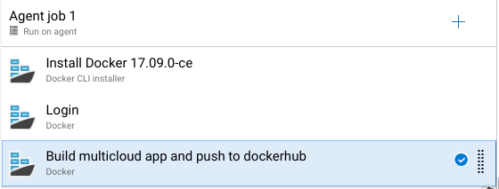

# Lab 06 - Application Pipeline #

### 1. Create Build pipeline ###

We will now create a new pipeline to build and deploy our application to each cloud provider.  

Go to `Pipelines` -> `Builds` and click `+ New` at the top. Following the same instructions as previous lab.  

`use classic editor`  
Choose `Github` and select our `multi-cloud-app` repository that we forked earlier in the workshop.  
Click continue and start with an `Empty job`.

In the pipeline editor, click on the pipeline bar to change the name like we did in the previous lab.  
Change the name to something like `Multicloud-app-deployment`. Also DO CHANGE the agent specification to `ubuntu-16.04`.

Add a `Docker CLI installer` task. You don't have to configure anything.  

Add 2 `Docker` tasks and configure:  

First docker task:  
Display name: `login`
Container registry: Click `+ new` select `docker hub` and fill in your credentials.  
Command: `login`

Second docker task:  
Display name: `Build multicloud app and push to dockerhub`  
Container registry: Select the account we added in the previous task  
Container repository: `YOURDOCKERUSERNAME/multi-cloud-app`  
Tags: Add `latest` on a new line in the text box.

Go to the `Triggers` tab and check `enable continuous integration`. This will make our pipeline run automatically whenever we commit new changes to our application repository on github.  

Now click `Save & Queue`. The image will start to build and get pushed to our dockerhub account.  

Your pipeline should look like this:  

### 2. Create Release pipeline ###

We are going to use a release pipeline to deploy the application automatically whenever a new build is available.

Go to `Pipelines` -> `Releases` -> `New pipeline` and start with an `Empty Job`

Click `Add an artifact` -> `Show 5 more artifact types` and select `Dockerhub`. Choose the service connection we created earlier and you should be able to fill in `namespaces` and `repository` from the dropdown menu.   

After adding the artifact, select the little circle with lightning bolt icon in the artifact box. Enable the continuous deployment trigger and fill in `latest` in the Tag filter. This will make the release trigger automatically after a new build gets pushed to your dockerhub account.  

Now go to `Tasks` at the top and click on `Agent Job`. Choose `ubuntu-16.04` in Agent specification.  

This will be a very simple pipeline. Search for the `SSH` task and add 3 of them.

First SSH task:  
Display name: `Deploy docker image to AWS`  

SSH service connection: click `manage`. This will open a new page where you can modify your service connections. Choose `New service connection` -> `SSH`.
Fill in:  
Connection Name: `AWS`
Host Name: `X.tf.aws.gluo.cloud` where X is your studentID number
User Name: ubuntu
Private key: click `upload SSH private key file` and upload the key you should have gotten from Slack earlier.

Now that we're on this page we might as well add a connection for azure and google too. Repeat the same actions as before but change your connection and host name accordingly.  
so for Azure:  
Connection Name: `Azure`  
Host Name: `X.tf.azure.gluo.cloud` where X is your studentID number  
For google:  
Connection Name: `Google`  
Host Name: `X.tf.google.gluo.cloud` where X is your studentID number  

The other settings are the same for all 3.  

You should have 3 connections now, so close this page and go back to the pipeline editor.  

Continue filling in your first SSH task:  
Display name: `Deploy docker image to AWS`  
SSH service connection: `AWS` you should be able to select this fron the dropdown menu now, if not try refreshing.  
Commands:
* `docker image pull YOURDOCKERHUBUSERNAME/multi-cloud-app:latest`
* `docker container run -d -p 80:80 YOURDOCKERHUBUSERNAME/multi-cloud-app:latest`  
Advanced: untick `Fail on STDERR`

Second SSH task:  
Display name: `Deploy docker image to Azure`  
SSH service connection: `Azure`  
Commands:
* `docker image pull YOURDOCKERHUBUSERNAME/multi-cloud-app:latest`
* `docker container run -d -p 80:80 YOURDOCKERHUBUSERNAME/multi-cloud-app:latest`  
Advanced: untick `Fail on STDERR`

Third SSH task:  
Display name: `Deploy docker image to Google`  
SSH service connection: `Google`  
Commands: 
* `docker image pull YOURDOCKERHUBUSERNAME/multi-cloud-app:latest`
* `docker container run -d -p 80:80 YOURDOCKERHUBUSERNAME/multi-cloud-app:latest`  
Advanced: untick `Fail on STDERR`

And that is it! You can now manually create a release to test by clicking on `Releases` in the left panel and selecting `Create release` in the top right.  

Or what's even more fun is making a change in your GitHub repository to run through your entire pipeline.  

If you don't know what to edit, just click `create new file` on your Github repository page. Give a name and click `commit new file`, it doesn't matter what's inside the file.  

Now that you've commited a change in your repo, your pipeline will start.  

This will: Build a Docker image  
-> Push it to DockerHub  
-> A new build on DockerHub will trigger your Release pipeline  
-> And deploy your fresh image to all 3 cloud providers.
